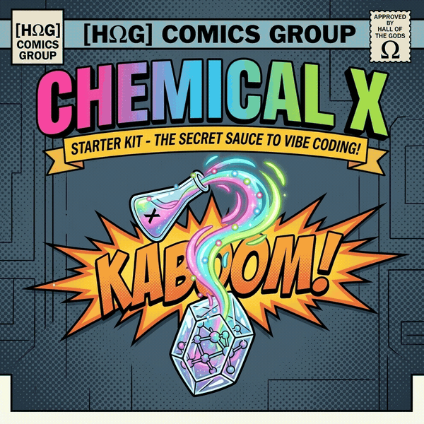

# Chemical X Protocol: Starter Kit

<p align="center">
  
</p>

[](https://chemicalx.xophz.com)
[](https://github.com/Chemical-X-Protocol/awesome-secret-sauce)
[](https://github.com/Chemical-X-Protocol/benchmarks)

Modular architecture blueprints, production hooks, and drop-in crystalline component capsule generators for high-velocity AI coding.

---

## Live Interactive Portal

Access the interactive book, prompt generator, and asset vault at [https://chemicalx.xophz.com](https://chemicalx.xophz.com).

---

## Structure

```
starter-kit/
├── blueprints/
│   ├── view-template.tsx       # < 20 line Table-of-Contents view blueprint
│   ├── molecule-capsule/       # Isolated crystalline molecule blueprint
│   └── composable-template.ts  # Standardized 3-to-5 return state composable
├── hooks/
│   ├── useAsyncData.ts         # 3-state async pipeline with toResult
│   ├── useSelfCleaningTimer.ts # Unmount-safe timer and RAF hook
│   └── useTwoStageDecision.ts  # Concept to Decision composition
└── cli/
    └── index.js                # Interactive capsule generator
```

---

## Model Context Protocol (MCP) Server

Chemical X includes a high-performance, zero-dependency JSON-RPC 2.0 Stdio MCP server that connects directly to AI agent hosts (Cursor, Claude Desktop, Windsurf, Antigravity, VS Code).

### Automatic 1-Step Installation

Run the interactive installer in your workspace root:

```bash
npx chemx install-mcp
```

This automatically registers the Chemical X server in:
- `.cursor/mcp.json` (Cursor IDE)
- `.vscode/mcp.json` (VS Code)
- `~/.gemini/config/mcp_config.json` (Antigravity)
- Adds `"chemx:mcp": "chemx mcp"` to your `package.json` scripts

### Manual MCP Server Configuration

To configure manually in your MCP client settings (e.g. `claude_desktop_config.json` or `.cursor/mcp.json`):

```json
{
  "mcpServers": {
    "chemical-x": {
      "command": "npx",
      "args": ["-y", "chemx", "mcp"]
    }
  }
}
```

### Available MCP Tools (10 Tools)

| Tool Name | Scope | Purpose |
| :--- | :--- | :--- |
| `chemx_q` | Discovery | AST search index query machine. Query symbols, capsules, props, and hooks with minimal token burn. |
| `chemx_query_patterns` | Discovery | Detect duplicated state machines, cloned UI layouts, and parallel hooks before decomposing monoliths. |
| `chemx_read` | Reading | Token-minified file reader. Extracts AST outlines, stripped comments, or symbol blocks (80%+ token savings). |
| `chemx_patch` | Editing | Surgically patch files with exact search and replace blocks without whole-file context dumps. |
| `chemx_check` | Linting | Verify a single file or capsule against molecular boundary rules (< 100L, 2-stage booleans, zero raw DOM). |
| `chemx_audit` | Quality | Run the full 7-Pillar Chemical X static AST audit. Returns health score, grade (A+ to F), and hazard list. |
| `chemx_audit_build` | Quality | Wrap build commands with silent execution and catalog compiler diagnostics into structured categories. |
| `chemx_autofix` | Remediation | Deterministically remediate safe violations (typography hyphens, markdown fences, AI slop comments). |
| `chemx_generate_capsule` | Scaffolding | Deterministically generate a crystalline capsule directory (component, controller, SCSS, types, index). |
| `chemx_get_refactor_prompt` | Prompting | Synthesize targeted refactoring prompts for Grade F critical hazards, hotspots, and slop artifacts. |

### Living Resources & Prompts

* **Resources**:
  * `chemx://directives`: Mandatory Chemical X Molecular Architecture directives (AGENTS.md).
  * `chemx://scorecard`: Live Molecular Health Index (MHI) grade, score, metrics, and active hazards.
  * `chemx://blueprints/molecule`: Compliant molecule blueprint adhering to zero raw DOM standards.
  * `chemx://blueprints/view-template`: Declarative 10-20 line Table-of-Contents view blueprint.
* **Prompts**:
  * `chemx_remediate_hotspot`: Dynamically inspects candidate file AST metrics and generates targeted decomposition instructions.
  * `chemx_harmonize_patterns`: Generates Pre-Split Pattern Discovery instructions to extract shared capsules.

---

## Release Versioning: Minute-Precision CalVer

This package adheres to **Minute-Precision Calendar Versioning** (`YY.MM.DD-MMMM`):
- `YY.MM.DD`: Release date (e.g. `26.9.14` for Sept 14, 2026).
- `MMMM`: Minute of the day (0 to 1439).

Because autonomous coding agent models update frequently, this package is continuously integrated and deployed via automated CI whenever new agent directives, AST checks, or framework rules are tuned. Rapid version iterations reflect active, daily alignment rather than breaking SemVer shifts.

> [!NOTE]
> Download statistics on npm reflect continuous automated test matrix verification and test runner execution across automated environments.

---

## License

Core CLI tools and capsule generators are distributed under the **MIT License**.  
Private production monorepos and extended starter suites are unlocked for verified GitHub Sponsors.  
Explore sponsorship details at [https://chemicalx.xophz.com](https://chemicalx.xophz.com).
