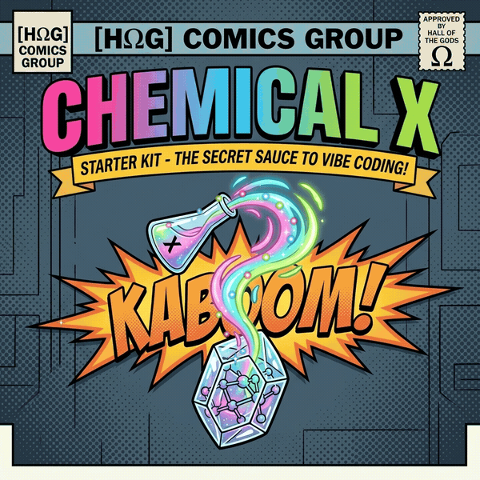

# Chemical X Protocol: Starter Kit

<p align="center">
  
</p>

[](https://chemicalx.xophz.com)
[](https://github.com/Chemical-X-Protocol/awesome-secret-sauce)
[](https://github.com/Chemical-X-Protocol/benchmarks)

Modular architecture blueprints, production hooks, and drop-in crystalline component capsule generators for high-velocity AI coding.

---

## Live Interactive Portal

Access the interactive book, prompt generator, and asset vault at [https://chemicalx.xophz.com](https://chemicalx.xophz.com).

---

## Quickstart: Scaffolding a New Project

Create a brand new molecular architecture project in seconds using your preferred package manager:

```bash
# npm (interactive or pass project directory)
npm create chemx my-molecular-app

# Choose framework (react, vue, or svelte)
npm create chemx my-molecular-app -- --framework=react

# Auto-install dependencies upon scaffolding
npm create chemx my-molecular-app -- --framework=react --install

# Automated / Agent / Headless mode (skips prompts, scaffolds Community Edition immediately)
npm create chemx my-molecular-app -- --yes

# npx
npx create-chemx my-molecular-app --framework=react --install --yes

# pnpm / yarn / bun
pnpm create chemx my-molecular-app --framework=vue
yarn create chemx my-molecular-app --framework=svelte
bun create chemx my-molecular-app
```

### Framework & Installation Flags
* `--framework=<react|vue|svelte>` (or `-f <name>`): Selects target framework. Scaffolds strictly matching components, file templates, and dependencies with zero cross-framework leakage.
* `--install`: Runs package manager install immediately after project creation.
* `--skip-install` (or `--no-install`): Explicitly skips automatic dependency installation (default).
* `--yes` (or `-y`): Automatically confirms prompts with standard molecular presets.

### Headless & Autonomous Agent Mode
When running in unattended environments (CI/CD pipelines, Cursor Agent, Windsurf, Claude Code, Antigravity), pass `--yes` (or `-y`, `--ci`, `--headless`) to bypass interactive terminal menus and immediately scaffold the free Community Edition with recommended architectural pillars:

```bash
npx create-chemx my-molecular-app --framework=react --install --yes
```

### Package Architecture: Scaffolder vs Command Engine
Chemical X provides two coordinated packages:
- **`create-chemx`**: Dedicated zero-configuration project scaffolder (`npm create chemx`). Directly provisions project templates, test suites, and architectural configurations.
- **`chemx`**: The full Molecular Architecture CLI & AST Query Engine. Manages audits, verifications, AST query lookups, code patching, and multi-agent swarm task coordination.

```bash
# Install chemx CLI globally or in your project:
npm install -g chemx
# or run on-demand:
npx chemx --help
```

---

## Structure

```
starter-kit/
├── blueprints/
│   ├── view-template.tsx       # < 20 line Table-of-Contents view blueprint
│   ├── molecule-capsule/       # Isolated crystalline molecule blueprint
│   └── composable-template.ts  # Standardized 3-to-5 return state composable
├── hooks/
│   ├── useAsyncData.ts         # 3-state async pipeline with toResult
│   ├── useSelfCleaningTimer.ts # Unmount-safe timer and RAF hook
│   └── useTwoStageDecision.ts  # Concept to Decision composition
└── cli/
    ├── index.js                # CLI router & capsule generator
    ├── verify.js               # Zero-token-burn verification engine
    ├── audit.js                # 7-Pillar static AST audit
    └── mcp/                    # Model Context Protocol stdio server
```

---

## Zero-Token-Burn Verification Pipeline

Running raw, unthrottled `npm test`, `tsc --noEmit`, or build tools dumps thousands of lines of passing checkmarks, compiler noise, and bundle asset tables into an AI agent's context window. This burns tokens prematurely and degrades context quality.

Chemical X wraps tests, typechecks, and builds into silent, failure-focused verification tools available via CLI and native MCP tools:

### Side-by-Side Benchmark Reports

#### 1. Test Suite: `npm test` vs `chemx test`

Ran across the starter-kit test suite (143 test cases across 8 spec suites):

| Metric | Raw `npm test` | Chemical X `chemx test` | Improvement |
| :--- | :--- | :--- | :--- |
| **Execution Time** | **~3.1s - 7.5s** | **~3.5s - 3.7s** | Identical underlying test speed |
| **Output Lines** | **957 lines** | **1 line** | **99.9% line reduction** |
| **Characters Streamed** | **49,246 characters** | **44 characters** | **99.9% character reduction** |
| **Agent Token Cost** | **~12,960 tokens** | **~12 tokens** | **12,948 tokens saved (99.9%)** |

```
# Raw npm test: Floods context with ~13,000 tokens of passing checkmarks
✔ resolveTargetDir: returns custom directory if provided as first argument (1.64ms)
✔ search-db: indexes symbols with line ranges and finds definition (56.65ms)
✔ Verify: parseTestOutput strips passing checkmarks and extracts only failing tests (1.01ms)
... [940 MORE LINES OF PASSING CHECKMARKS & TIMINGS] ...
ℹ tests 143 | pass 143 | fail 0 | duration_ms 3002.57ms

# Chemical X: Pinpoint single-line summary
$ npx chemx test
  ✔ All tests passed (143 tests in 3500ms)
```

#### 2. TypeScript Typecheck: `npm run typecheck` vs `chemx typecheck`

| Metric | Raw `npm run typecheck` | Chemical X `chemx typecheck` | Difference |
| :--- | :--- | :--- | :--- |
| **Execution Time** | **1.85s** | **2.06s** | **+0.21s** (lightweight wrapper) |
| **Output Characters** | 54 characters | **40 characters** | **26% reduction** |
| **Context Token Cost** | ~14 tokens | **~10 tokens** | **~28% reduction** |
| **Clean Output** | npm script banner noise | Single clean status line | Zero CLI banner noise |
| **JSON Mode (`--json`)** | Not supported | **~30 tokens** structured JSON | Direct agent ingestion |

```bash
# Clean, banner-free terminal verification
$ npx chemx typecheck
  ✔ TypeScript typecheck clean (1820ms)

# Machine-readable output for AI agents
# (one minified line; `errors` is always an array of "file:line:col CODE message" rows)
$ npx chemx typecheck --json
{"success":true,"exitCode":0,"command":"npm run typecheck","durationMs":1820,"errorCount":0,"errors":[]}
$ npx chemx typecheck --json   # with a type error
{"success":false,"exitCode":2,"command":"npm run typecheck","durationMs":1009,"errorCount":1,"errors":["src/a.ts:1:7 TS2322 Type 'string' is not assignable to type 'number'."]}
```

#### 3. Production Build: Raw Build vs `chemx build`

| Metric | Raw Production Build | Chemical X `chemx build` | Chemical X `--silent` |
| :--- | :--- | :--- | :--- |
| **Terminal Output** | Multi-page asset size tables & chunks | Single status line | **0 lines (completely silent)** |
| **Token Cost (Success)** | **~2,000 - 8,000 tokens** | **~15 tokens** | **0 tokens** |
| **Failure Diagnosis** | Scatted across hundreds of lines | Categorized diagnostic buckets | Exact failure lines only |

```bash
$ npx chemx build
Auditing build: npx tsc --noEmit
✔ Build Succeeded (5.20s)
```

#### 4. Full Pipeline: `chemx verify` Grand Total

When an AI agent runs a complete pre-commit or post-refactor verification pass:

| Verification Stage | Raw Unthrottled Shell Commands | Chemical X `chemx verify` |
| :--- | :--- | :--- |
| **7-Pillar AST Audit** | ~4,000 tokens | Included |
| **TypeScript Compilation** | ~14 tokens | Included |
| **Project Test Suite** | ~12,960 tokens | Included |
| **Total Context Burn** | **~17,000+ tokens** | **~45 tokens** |
| **Context Savings** | Baseline | **99.7% Token Reduction** |

```
$ npx chemx verify --dir=blueprints

  ⚡ Chemical X: Token-Conserving Project Verification

  ✔ AST Architecture:  A+ (100/100, 0 violations)
  ✔ TypeScript:        Clean (0 errors)
  ✔ Test Suite:        Passed (143/143)

  All verification checks passed with zero context burn!
```

---

## CLI Command Reference & Workflow

The `chemx` command suite is specifically tailored for token conservation, instant feedback, and zero terminal clutter:

### 1. Verification & Quality
```bash
# Full verification pipeline (AST Audit + Typecheck + Tests) -> ~45 token status card
chemx verify
chemx verify --json

# Run 7-Pillar static AST audit
chemx audit
chemx audit --unroll        # Inspect individual hazard lines and explanations
chemx audit --strict        # Fail on any violation, including minor style warnings
chemx audit --json          # Machine-readable format for agent pipelines
chemx audit --each=submodules   # Audit every submodule (or =workspaces) as its own scope
chemx audit --feed=scopes       # Recorded results per scope; also =history, =pillars (no audit runs)
chemx audit --feed --json       # Every recorded run as rows, ready for a dashboard

# Silent TypeScript compilation check (suppresses passing noise, returns error lines)
chemx typecheck
chemx typecheck --json

# Silent test runner (suppresses passing tests, extracts only failing assertions & stack diffs)
chemx test
chemx test --json

# Silent build audit (categorizes diagnostics into TypeScript, Rollup, and style budgets)
chemx build
chemx build --json
```

#### Interactive audit navigator

Run `chemx audit` in a terminal and it opens a menu after the scorecard. It first asks whether to publish the report to GitHub Discussions; the default is **Skip to Menu**, so pressing Enter never posts anything. The menu is grouped, with a divider between groups and rows numbered from 1:

- **Fix**: Self-Healing Roadmap, Copy AI Prompt (when there is a prompt to copy), Hotspots (when monolith files exist), Full Report.
- **Grades**: one row per pillar that has open items, riskiest first, then a single `✓ N pillars clean` row that lists the clean pillars when selected.
- **Setup**: only what is not installed yet. *Guardrails* installs the pre-commit hook and GitHub CI workflow. *Query Index* adds a `"chemx": "chemx"` package script and builds `.chemx/index.db` so agents can run `chemx q`. A row disappears once its install is detected, and the group disappears when nothing is missing.
- **Track**: Progress, Export, Badge, Share.
- Guide, Upgrade, Re-Run, Exit.

### 2. AST Query Engine & Surgical Inspection
```bash
# Hybrid search (BM25 keyword + feature-hash name similarity via Reciprocal Rank Fusion; lexical, not a learned embedding)
chemx q "useAttentionCardController" --hybrid --json

# Transitive blast radius analysis before refactoring foundational capsules
chemx q "a-button" --blast-radius --json

# Inspect component props, hooks, and types without reading entire files
chemx q "m-task-list" --inspect

# Surgical token-optimized file reader (AST outlines, specific symbols, N| line numbers; verbatim unless --strip-comments)
chemx read src/components/m-card.vue --symbol=useCardController
chemx read src/components/m-card.vue --outline
chemx read src/components/m-card.vue --start=10 --end=40

# Surgical file patching without full-file rewrites (literal replace, atomic write, backup).
# Multi-line edits: SEARCH/REPLACE blocks in a quoted heredoc ($, quotes and backticks stay literal).
# Repeat the block for several edits; they apply in order and all-or-nothing. To edit text that
# itself contains these markers, use 8 or more characters on all three marker lines.
chemx patch <file> [--dry-run] <<'PATCH'
<<<<<<< SEARCH
const total = items.length;
=======
const total = items.filter(Boolean).length;
>>>>>>> REPLACE
PATCH
# One-pair form
chemx patch <file> --target="oldCode" --replacement="newCode" --dry-run   # preview the unified diff
chemx patch <file> --target="oldCode" --replacement="newCode"
# Removing a top-level declaration (renames included) is refused unless named
chemx patch <file> --target="oldName" --replacement="newName" --allow-remove=oldName

# write creates files; replacing an existing one needs --overwrite. Unknown flags refuse.
chemx write <file> - [--overwrite] [--dry-run] <<'EOF'
export const a = 1;
EOF
chemx write <file> --content="export const a = 1;" [--overwrite] [--dry-run]
```

### 3. Crystalline Capsule Generator
Scaffold production-ready component capsules matching strict zero-raw-DOM standards:
```bash
# Molecule capsule (component, controller, glass styling, types, spec)
chemx m-task-card
chemx m-task-card --framework=react       # Explicit framework (react, vue, or svelte)

# Atom foundation (the only tier permitted raw HTML elements)
chemx a-status-pill --framework=vue

# Organism module (complex grouping of molecules and atoms)
chemx o-workspace-header --framework=svelte

# Pure reactive hook / domain composable
chemx use-task-filter
```

### 4. Database-Driven Multi-Agent Swarm Coordination
Coordinate multi-agent swarms using the local SQLite store (`.chemx/index.db`) without multi-thousand-token markdown specification bloat:
```bash
# Auto-triage: convert AST audit hazards directly into assignable team tasks
chemx team task triage

# List tasks assigned to a specific agent
chemx team task list --agent=@agent-alpha

# Claim an open task
chemx team task claim 1 --as=@agent-alpha

# Mark task complete with inline AST verification gate
# Re-audits target file on disk to guarantee zero blocking hazards before completion:
chemx team task done 1 --as=@agent-alpha --target=src/components/m-card.vue

# Emergency override / escape hatch: complete task despite non-blocking warnings:
chemx team task done 1 --as=@agent-alpha --target=src/components/m-card.vue --force

# Inspect multi-agent swarm status and lock queues
chemx team status
```

### 5. Live Swarm Web UI & Direct Task Routing
Launch the real-time Chemical X Swarm Control Panel backed by SQLite (`.chemx/index.db`) with full SPA routing and deep linking:
```bash
# Launch Live Swarm Web UI (binds 127.0.0.1:4173 and prints a tokened URL)
npx chemx ui

# Launch on a custom port
npx chemx ui --port=8080
```

* **Access token:** every launch generates a random token. Open the printed `http://127.0.0.1:4173/?token=...` URL; the page then keeps the token in a same-site cookie. API clients send it as the `X-Chemx-Token` header. Requests from other origins, non-JSON POSTs and unknown `Host` headers are refused.
* **Bind address:** the UI listens on `127.0.0.1` by default. `--host=0.0.0.0` must be passed explicitly and prints a warning.
* **Read-only SQL console:** the Database Studio console runs on a read-only connection and accepts one `SELECT`/`WITH`/`VALUES`/`EXPLAIN` or read-only `PRAGMA` statement per request.

* **Direct Task Routing:** Link straight to any task in the Kanban board: `http://localhost:4173/tasks/:id` (e.g. `http://localhost:4173/tasks/42`)
* **Auto-Focus & Highlighting:** Opening a task route automatically switches to the **📋 Tasks & Kanban** view, smoothly centers the card, and illuminates it with a cyan highlight glow.
* **One-Click Share:** Click the `🔗` icon on any Kanban card to copy its direct URL straight to your clipboard.
* **Single-Task API:** Fetch individual task state and verification diff receipts directly via `GET /api/tasks/:id`.

---

## Language-Agnostic Polyglot Architecture

Chemical X is **language-agnostic**. The core physics of AI agent code generation—**Zero Context Rot, Monolith Slicing, and Verified Anti-Hallucination Gating**—apply universally across backend, frontend, and systems stacks.

### Supported Language Ecosystems

| Language / Framework | Extensions | Parser Engine | Capabilities |
| :--- | :--- | :--- | :--- |
| **C# / .NET 10** | `.cs` | Structural Regex / AST | Line budgets, MediatR handlers, shallow catch detection, fake in-memory stubs (`UseInMemoryDatabase`), `using` namespace indexing |
| **Python** | `.py` | Structural Regex / AST | Line budgets, AI slop text patterns, fake assertions (`assert True`), `def`/`class` and `import` indexing |
| **Go** | `.go` | Structural Regex / AST | Line budgets, mock data scanning, tautological assertions, `func`/`type` package indexing |
| **Rust** | `.rs` | Structural Regex / AST | Line budgets, AI slop text patterns, secret scanning, struct and fn indexing |
| **TypeScript / JavaScript** | `.ts`, `.tsx`, `.js`, `.jsx` | `@babel/parser` AST (`.vue` via `@vue/compiler-sfc`: every script block plus the template) | AST visitors across 11 audit categories, mapped to the 7 pillars; hook contracts, 2-stage booleans |
| **Vue & Svelte** | `.vue`, `.svelte` | Babel + Template Registry | SFC template clone detection, reactive state verification |

### Two-Tier Decoupled Audit Pipeline
1. **Tier 1: Universal Polyglot Rules (Runs on ALL languages)**
   * **Line Budgets (`LINE_BUDGET_FILE`, `LINE_BUDGET_MOLECULE`):** Line budget: soft warning at 250 lines when complexity is high (default profile); --profile=atomic-strict caps capsules at 100 lines. Any file above 500 lines is flagged (HIGH at 1,000, CRITICAL at 2,000). AGENTS.md 1.A is the policy.
   * **AI Slop Text Patterns:** Strips conversational residue (*"Here is the code"*), leaked markdown code fences, and lazy truncation placeholders (`// ... rest of implementation`).
   * **Synthetic Mock Data Scanners:** Catches fake emails (`@example.com`), `555-` phone numbers, and hardcoded dummy collections in services.
   * **Security & Secret Guards:** Scans for high-entropy API keys, JWTs, AWS credentials, and unmanaged sensitive logging.
   * **Polyglot Fake Green Tests:** Catches tautological assertions in C# (`Assert.True(true)`), Python (`assert True`), and Go (`assert.True(t, true)`).
2. **Tier 2: Deep Language-Specific Analyzers**
   * **Babel Engine:** Deep AST inspection for JS/TS/Vue/Svelte (zero false-positive syntax errors on non-JS code).
   * **C# / Clean Architecture Analyzer:** Flags empty `catch (Exception) {}` blocks, simulated delays (`Task.Delay`), and monolithic controllers.
   * **Swallowed catches (`ERROR_SWALLOWED_EXCEPTION`, `AI_SLOP_SHALLOW_CATCH`):** Each swallowing catch site reports once, as `ERROR_SWALLOWED_EXCEPTION` when the error is discarded or `AI_SLOP_SHALLOW_CATCH` when it is only logged to the console. Both are MEDIUM by default. A JS/TS catch escalates to HIGH when a `let` or `var` assigned in the try is read after it with no default or check first (silent `undefined` propagation); C# findings stay MEDIUM. Mark an intentional swallow with a `chemx-allow: best-effort <reason>` comment on the line above the catch, on the catch line, inside its body, or after the try block's closing brace when `catch` starts the next line. Only comments count (never string literals), and the reason is mandatory: an annotation without one is still flagged and its hazard says so.

---

## The 7 Molecular Architecture Pillars

Chemical X enforces seven core architectural directives configured via `chemx pillars`:

1. **Molecular Line Budgets**: Single-purpose files, measured by structural weight first. Line budget: soft warning at 250 lines when complexity is high (default profile); --profile=atomic-strict caps capsules at 100 lines. Eliminates context rot and cuts token ingestion costs.
2. **Strict Component Tiers & Zero-Raw-DOM**: Raw HTML elements (`<button>`, `<input>`, `<div>`) are strictly isolated inside foundational **Atoms** (`a-*`). Molecules, Organisms, Templates, and Views assemble atoms and never contain raw tags.
3. **Table-of-Contents Views**: Top-level page views are clean, 10–20 line declarative blueprints assembling self-contained molecules and organisms via named slots (`#header`, `#default`, `#modals`).
4. **Molecular Composable Contracts**: Composables return plain destructurable objects with a strict 3-to-5 property limit (State + Status + Actions). Domain types use discriminated unions (zero impossible states).
5. **Silent Verification Pipeline**: Verification tools suppress passing checkmarks and compiler banners, returning token-compact summaries (~45 tokens) to protect AI agent context windows.
6. **AST Codebase Query Engine**: In-band AST symbol graph lookups, blast radius calculations, and outline extraction eliminate blind full-file context dumps.
7. **Database-First Swarm Coordination**: Task backlogs, file locks, and agent communications live in local SQLite (`.chemx/index.db`) rather than monolithic markdown specifications.

---

## Model Context Protocol (MCP) Server

Chemical X includes a high-performance, native Node.js JSON-RPC 2.0 Stdio MCP server that connects directly to AI agent hosts (Cursor, Claude Desktop, Windsurf, Antigravity, VS Code).

### Automatic 1-Step Installation

Run the interactive installer in your workspace root:

```bash
npx chemx install-mcp
```

This registers the Chemical X server in:
- `.cursor/mcp.json` (Cursor IDE, `mcpServers` key)
- `.vscode/mcp.json` (VS Code, `servers` key with `type: "stdio"`)
- `~/.gemini/config/mcp_config.json` (Antigravity) only with `npx chemx install-mcp --global`

Installing the npm package never edits any config: `postinstall` only prints a one-line hint (silent in CI or with `CHEMX_SKIP_POSTINSTALL=1`).
Existing configs are merged, not replaced: other servers and keys are kept, the previous file is saved as `<file>.bak`, and a file that is not valid JSON, or that has comments a rewrite would drop, is left untouched with the entry to add by hand.

### Manual MCP Server Configuration

To configure manually in your MCP client settings (e.g. `claude_desktop_config.json` or `.cursor/mcp.json`):

```json
{
  "mcpServers": {
    "chemical-x": {
      "command": "npx",
      "args": ["-y", "chemx", "mcp"]
    }
  }
}
```

### The `chemx` MCP Tool

The server exposes one tool, `chemx({ action, params })`. `commands: [...]` runs several actions in one call. Mutating actions (`write`, `patch`, `autofix`, `generate`, team claims and posts) need `params.projectRoot` set to the absolute repo path.

| Actions | Scope | Purpose |
| :--- | :--- | :--- |
| `verify`, `typecheck`, `test`, `build` | Verification | Audit + typecheck + tests as one compact card; silent typecheck and test runners; build diagnostics grouped by category. |
| `audit`, `check`, `autofix`, `patterns` | Quality | Architectural AST audit, single-file check, deterministic safe fixes, duplicated-pattern detection. |
| `q`, `search`, `trace`, `backtrace` | Discovery | AST index queries, forward call traces and upstream caller chains. |
| `read`, `patch`, `write` | Reading and editing | Outline, symbol or line-range reads; exact search/replace patches; whole-file writes with re-indexing. |
| `d`, `diff`, `log`, `p`, `pkg`, `f`, `ls`, `j`, `json`, `do`, `batch` | Wrappers | Token-bounded git diff/log, package.json, file finder, JSON shape and batched commands. |
| `team`, `team_status`, `team_feed`, `team_post`, `team_task`, `team_lock`, `project` | Coordination | Swarm task queue, feed, posts, file locks and project sessions in `.chemx/index.db`. |
| `generate`, `issue`, `tesseract` | Other | Capsule generation, sanitized issue reports, agent onboarding payload. |

`tools/list` returns one tool, `chemx`. Pick the operation with `action` (the enum is generated from the live dispatcher); `{ "action": "help" }` returns every action with its parameters. The legacy `chemx_*` sub-tools are hidden from `tools/list` but still callable by name.

Call forms:

| Form | Example |
| :--- | :--- |
| Action + params | `{ "action": "read", "projectRoot": "/abs/repo", "params": { "path": "src/a.ts", "outline": true } }` |
| CLI string | `{ "command": "q useBrandingStore --blast-radius" }` |
| Batch of strings | `{ "commands": ["d", "p -s", "verify"] }` |
| Batch of objects | `{ "batch": [{ "action": "p" }, { "action": "log" }] }` |

Contract:
- **Root.** Each call resolves one project root: `projectRoot` > MCP `roots/list` > the server's start argument (`chemx mcp <dir>`) > `CHEMX_PROJECT_ROOT` > the start directory only if it has `.chemxrc`/`.chemx`. Otherwise the call is refused. An absolute path never picks its own root, and `params.cwd` never overrides it. When MCP roots or a start argument exist, `projectRoot` must sit inside one of them. Paths (including git path arguments to `d`/`log`) must resolve inside the root after following symlinks. Set `CHEMX_MCP_ALLOWED_ROOTS` (path-delimited) to pin the boundary further.
- **Writes** (`write`, `patch`, `autofix`, `generate`, team writes, `issue` with `autoPost`, `audit` with `triage`, `check RESTART_MCP`) are refused when the root was only guessed from the start directory.
- **Shell.** `build`/`test`/`typecheck` with `params.command` run only when the command is a `package.json` script of the project (its body, or `npm run <name>`), unless the server runs with `CHEMX_MCP_ALLOW_SHELL=1`. Children get no stdin and a timeout (`CHEMX_CHILD_TIMEOUT_MS`, default 15 min).
- **Batch.** Every item is scope-checked before any item runs; the batch status is the worst item status (`fail` > `inconclusive` > `pass`).
- **Results.** Plain text without ANSI. Every result ends with `chemx root: <root> (<source>) v<version>`. When the code on disk differs from the running server you also get `stale chemx MCP server (loaded X, disk Y): reconnect via /mcp`.
- **Protocol.** `serverInfo.version` is the package version. Long calls honour `_meta.progressToken` (progress notifications) and `notifications/cancelled`.

### Living Resources & Prompts

* **Resources**:
  * `chemx://directives`: Mandatory Chemical X Molecular Architecture directives (AGENTS.md).
  * `chemx://scorecard`: Live Molecular Health Index (MHI) grade, score, metrics, and active hazards.
  * `chemx://blueprints/molecule`: Compliant molecule blueprint adhering to zero raw DOM standards.
  * `chemx://blueprints/view-template`: Declarative 10-20 line Table-of-Contents view blueprint.
* **Prompts**:
  * `chemx_remediate_hotspot`: Dynamically inspects candidate file AST metrics and generates targeted decomposition instructions.
  * `chemx_harmonize_patterns`: Generates Pre-Split Pattern Discovery instructions to extract shared capsules.

---

## Release Versioning: Minute-Precision CalVer

This package adheres to **Minute-Precision Calendar Versioning** (`YY.MM.DD-MMMM`):
- `YY.MM.DD`: Release date (e.g. `26.9.17` for Sept 17, 2026).
- `MMMM`: Minute of the day (0 to 1439).

Check installed version at any time:
```bash
npx chemx --version
# create-chemx v26.9.17-606
```

### Package Pairing & npm Registry Propagation

- **Package Pairing**: `@chemx/create-chemx` and `chemx` publish together under synchronized minute-precision CalVer timestamps (`YY.M.D-minute`). For consistent behavior, install or pin the matching release versions.
- **npm Registry Propagation Note**: Newly published releases on npm can take 2–5 minutes to propagate across all edge CDN mirrors after `npm view` lists them. If `npm install` intermittently fails with a 404 on an exact newly published version, wait a few minutes and retry.

Because autonomous coding agent models update frequently, this package is continuously integrated and deployed via automated CI whenever new agent directives, AST checks, or framework rules are tuned. Rapid version iterations reflect active, daily alignment rather than breaking SemVer shifts.

> [!NOTE]
> Download statistics on npm reflect continuous automated test matrix verification and test runner execution across automated environments.

---

## Privacy & network

chemx itself makes no network requests outside the explicit flows in the table below. Audit, verify, search, read, patch, generate and team commands send nothing. Your own test or build tools, which verify runs, may still use the network. A spec (`cli/network-isolation.spec.js`) runs commands with `fetch` and `gh` recorded to keep it that way. `chemx ui` serves a local page on your machine. It does not call out.

### What is sent, when, and to which host

| Flow | When | Host | What is sent |
| :--- | :--- | :--- | :--- |
| License download | `chemx init`, `chemx create` / `npm create chemx`, only when a license key is supplied | `https://chemicalx.xophz.com/api/starter-kit/download` | your license key and device id |
| License fallback check | only if the download host is unreachable | `https://mycompassconsulting.com/wp-json/compass/v1/gatekeeper/licenses/validate` | your license key and device id |
| Audit share | `chemx audit --share`, or Share in the audit navigator | GitHub (`api.github.com` with `GH_TOKEN`/`GITHUB_TOKEN`, otherwise the `gh` CLI) | the discussion title and body, which are printed in full before you confirm |
| Error report | only with `--post-issue`, the MCP `autoPost` flag, or `CHEMX_AUTO_POST_ISSUES=true` | GitHub Issues in `CHEMX_ISSUES_REPO`, your repo's GitHub remote, or `Chemical-X-Protocol/starter-kit` | the sanitized error report (tokens, license keys and your home path are masked), which is printed in full before it is posted and is also saved to `.chemx/issues/` |

Notes:
- **Share asks first.** It prints the target repo, category, title and body, then asks `[y/N]`, which defaults to no. In a non-interactive session it refuses unless you pass `--yes`.
- **No implicit error posting.** A CI token on its own never posts an issue. When posting is on, chemx prints the target repo, title and body to stderr before sending. It does this even with `--json` or `--silent`, which keep stdout clean. The one exception is the MCP `chemx_report_issue` tool: it posts without printing, because its stdout is the protocol channel, and it returns the exact title, body and URL it sent to the calling agent.
- **Secrets are masked everywhere a report goes.** Keys passed with `--license`, `CX-` keys, GitHub and npm tokens, and the values of secret-named fields in a report's extra metadata (`token`, `password`, `license`, and so on) are masked. This covers the report file, the issue title, body and prefilled URL, the failure line printed to stderr, and the swarm task that tracks a posted issue.
- **Device id.** This is a random UUID (`crypto.randomUUID()`). It identifies an install for license seat counting and carries no hardware or personal data. Older `cli_*` ids are kept as they are.
- **Keys travel over HTTPS only.** `CHEMICAL_X_API_URL` and `COMPASS_GATEKEEPER_URL` can point the license flow at another server, for staging or self-hosting. An override must use `https://`. Plain `http://` is accepted only for `localhost` and `127.0.0.1`. Any other override is refused, with no fallback. When an override is in use, chemx prints its host.

### Where it is stored

| File | Contents | Permissions |
| :--- | :--- | :--- |
| `$XDG_CONFIG_HOME/chemx/config.json` (default `~/.config/chemx/config.json`) | the license key you entered or verified | `0600`, in a `0700` directory |
| `$XDG_CONFIG_HOME/chemx/device_id` | the random device id | `0600` |
| `<project>/.chemx/discussion.json` | the number and URL of the discussion you shared, so the next share updates it | project-local |

On first use, chemx moves an older `~/.chemical-x/` config into the XDG directory. It tightens the permissions and deletes the old copy. Unknown files in `~/.chemical-x/` are left in place.

For CI, set `CHEMX_LICENSE_KEY`. It is read from the environment and is never written to disk.

### How to turn it off

```bash
export CHEMX_OFFLINE=1   # chemx's own switch
export DO_NOT_TRACK=1    # the cross-tool convention; chemx honors it the same way
```

Either variable disables every network call. The gated flows say so clearly and make no request:
- **License download:** scaffolding continues with the bundled Community blueprints.
- **Share:** nothing is posted.
- **Error report:** the report is saved locally only, and chemx prints the reason and the report's path.

To remove stored data, delete `~/.config/chemx/` and the project's `.chemx/discussion.json`.

---

## License

Core CLI tools and capsule generators are distributed under the **MIT License**.  
Private production monorepos and extended starter suites are unlocked for verified GitHub Sponsors.  
Explore sponsorship details at [https://chemicalx.xophz.com](https://chemicalx.xophz.com).
